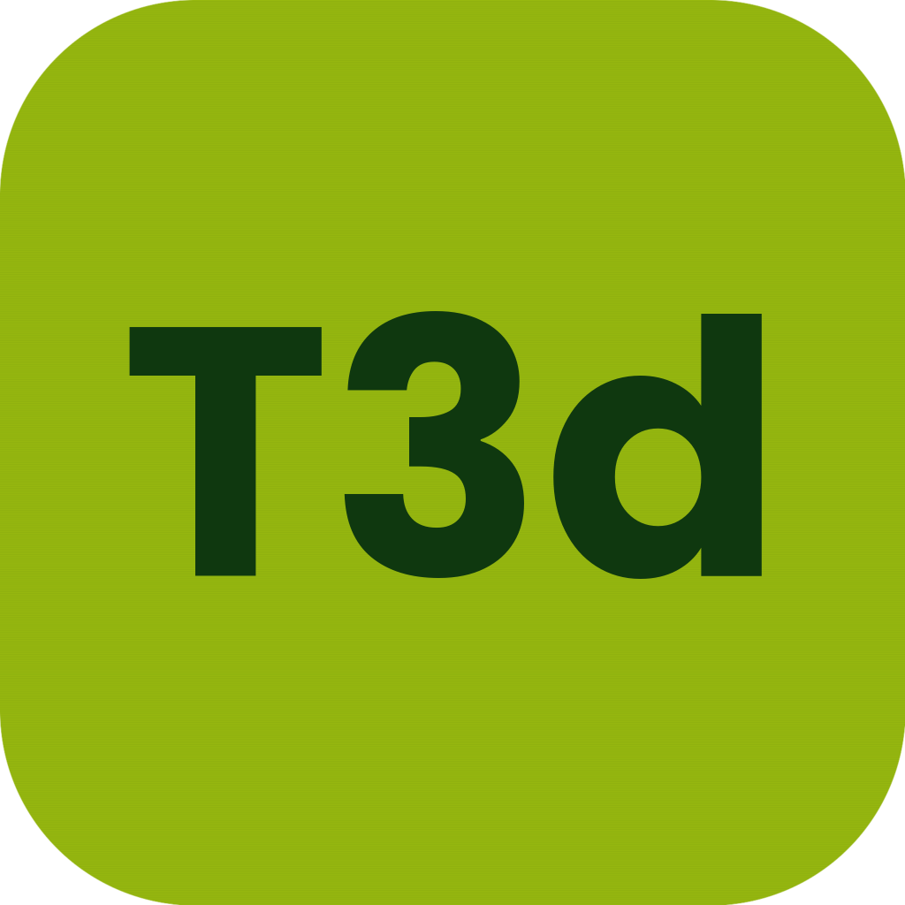

# T3d Boy

A native macOS Game Boy and Game Boy Color emulator, written from scratch in Swift.



## Features

- **Full Game Boy (DMG) and Game Boy Color emulation** — SM83 CPU, scanline PPU,
  timers, interrupts, OAM/HDMA DMA, MBC1/2/3/5 cartridges, double-speed mode
- **Sound** — all four audio channels via a cycle-stepped APU
- **ROM library** with auto-generated box art (each game's title screen, captured
  by booting it headlessly), GB / GBC / Favourites tabs, sorting by name,
  review score, or play time, and per-game play-time tracking
- **Per-system ROM folders** — point each tab at its own folder
- **Save states** (5 slots per game), **pause**, and a **fake boot screen** with
  T3d's chime
- **Hardcore Lighting** — recreates the non-backlit DMG by dimming the screen to match
  your room's ambient light (⌃⌘H)
- **Worm Light** — a warm, aimable '90s-style clip-on light that reflects across the
  screen so you can see in the dark; drag it on the game preview display to angle it (⌃⌘L)
- **RetroAchievements** — optional sign-in to track unlocks, points, leaderboards,
  and mastery, with an achievements drawer you can pop out in the library or in-game,
  plus an optional hardcore mode. See [docs/retroachievements.md](docs/retroachievements.md)
- **Game controller support** (DualShock / DualSense / Xbox / Switch Pro over
  Bluetooth) via Apple's GameController framework
- **Preferences (⌘,)** for RetroAchievements and appearance — **dark mode by
  default** (switchable to light) and an optional **FPS counter**
- A guided **first-run onboarding** hosted by **T3d**, the pixel mascot

## Controls

| Game Boy | Keyboard | Controller |
|----------|----------|------------|
| D-pad    | Arrow keys | D-pad / left stick |
| A / B    | Z / X    | Circle / Cross (east / south) |
| Start    | Return   | Menu / Options |
| Select   | Shift    | Share |
| Pause    | Space    | — |
| Save / load state | ⌘1–5 / ⇧⌘1–5 | — |

## Building

Requires Xcode command-line tools (Swift 5+). No Xcode project — a single script
compiles the sources, builds `T3d Boy.app`, and packages a DMG:

```sh
./build.sh
```

The output is `build/T3dBoy-<version>.dmg`. The version comes from the `VERSION`
file (see [RELEASING.md](RELEASING.md)).

### Headless verification

The app binary has test modes used during development:

```sh
BIN="build/T3d Boy.app/Contents/MacOS/T3d Boy"
"$BIN" --test <rom> --frames 600 --out shot.png   # dump a screenshot
"$BIN" --art  <rom> art.png                        # preview library box art
"$BIN" --boot boot.png [cgb]                        # render the boot logo
"$BIN" --ratest                                     # RetroAchievements unit tests
"$BIN" --dingtest                                   # measure the boot chime pitch
```

## Installing

T3d Boy is **ad-hoc signed** (not notarized by Apple), so on first launch macOS
will refuse to open it with an "unidentified developer" warning. To open it:

1. **Right-click** (or Control-click) the app in Applications → **Open** →
   **Open** again in the dialog. macOS remembers this choice afterwards.

If that still fails (e.g. "damaged and can't be opened"), clear the quarantine flag:

```sh
xattr -dr com.apple.quarantine "/Applications/T3d Boy.app"
```

## ROMs

This repository contains **only the emulator** — no game ROMs. Game Boy games are
copyrighted; supply your own `.gb`, `.gbc`, or zipped ROM files and point T3d Boy
at the folder containing them.

## License

Personal project. Not affiliated with Nintendo. "Game Boy" is a trademark of
Nintendo; this emulator ships no Nintendo code or assets (the boot screen is an
original creation).
