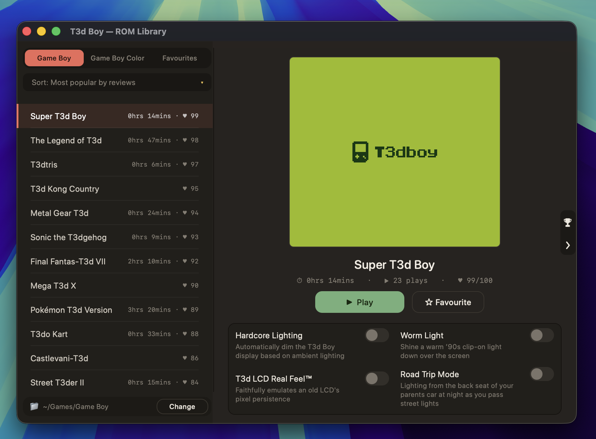
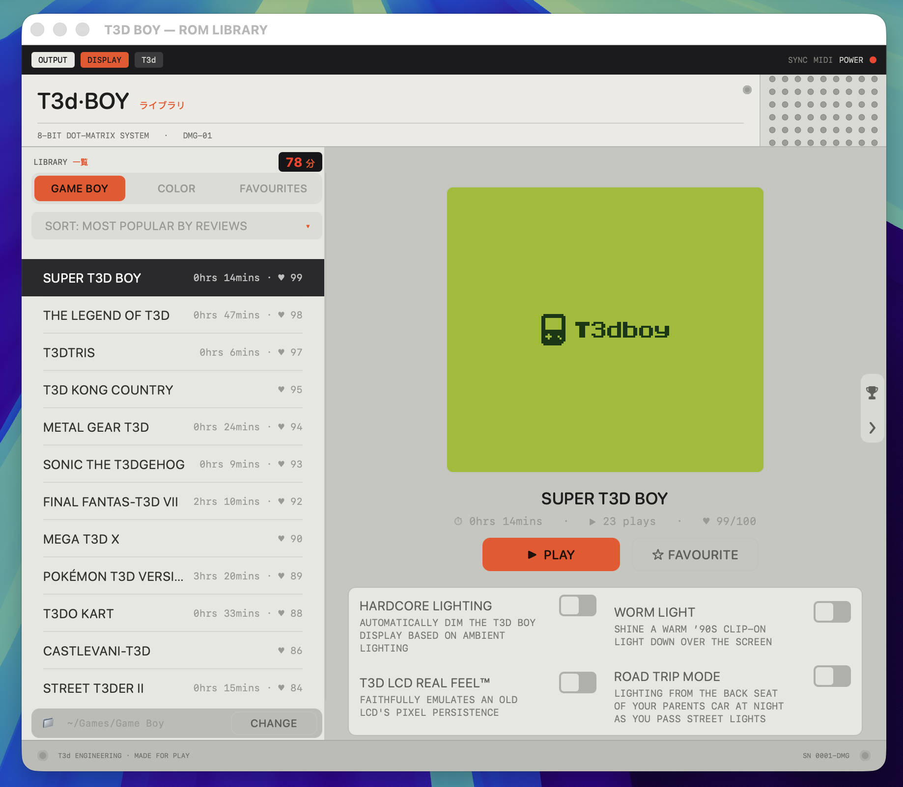

# T3d Boy

A native macOS Game Boy and Game Boy Color emulator, written from scratch in Swift.



## Features

- **Four switchable themes** — give the whole app a different personality from
  Preferences ▸ Appearance:
  - **Classic** — clean, system-native macOS (light or dark).
  - **Pistachio** *(default)* — a warm soft-dark skin with rounded type and a coral /
    pistachio palette.
  - **Engineer** — a boutique-synth-style hardware look: a light-grey "device" body
    with orange rubber keys, red-LED read-outs, a drilled speaker grille, hex screws, and
    a live LED counter of your total play time.
  - **Liquid Glass** — thought Apple's implementation of Liquid Glass was bad? T3d Boy
    takes it to another level of let-down. The whole app becomes a see-through sheet of
    glass — the desktop shows straight through it — and the buttons are glass too, slowly
    *melting*, with droplets drooling off their edges.

  

- **Full Game Boy (DMG) and Game Boy Color emulation** — SM83 CPU, scanline PPU, timers,
  interrupts, OAM/HDMA DMA, MBC1/2/3/5 cartridges, double-speed mode, and all four audio
  channels via a cycle-stepped APU
- **RetroAchievements** — optional sign-in to track unlocks, points, leaderboards and
  mastery, with a pop-out achievements drawer (in the library or in-game) and an optional
  hardcore mode. See [docs/retroachievements.md](docs/retroachievements.md)
- **Focused play** — games open by zooming out of their box art into a clean, chrome-free
  window with a power-switch click and dimmed surroundings; a subtle auto-hiding control
  bar offers the lighting toggles, full screen, and exit
- **Built for everyone** — full **VoiceOver** support and **keyboard navigation**
  (Tab + focus rings), plus **Reduce Motion** support. See
  [docs/accessibility.md](docs/accessibility.md)
- **Authentic display effects** —
  - *Hardcore Lighting* dims the screen to your room's ambient light, like the
    non-backlit DMG (⌃⌘H). Needs a Mac that can read ambient light — see
    [supported devices](docs/user-guide.md#hardcore-lighting--supported-devices)
  - *Worm Light* is a warm, aimable '90s clip-on light you drag to angle (⌃⌘L)
  - *T3d LCD Real Feel™* blends frames to recreate LCD pixel persistence, so games that
    faked transparency by flickering render as intended instead of strobing
  - *T3d Boy Light* — the Game Boy Light's electroluminescent teal-blue backlight: the
    screen glows an even teal with a gently darker vignette toward the edges (⌃⌘B)
- **ROM library** with auto-generated box art (each game's title screen, captured by
  booting it headlessly), Game Boy / Color / Favourites tabs, sorting by popularity,
  name or play time, and per-game play-time tracking
- **Save states** (5 slots per game), **pause**, and **game controller support**
  (DualShock / DualSense / Xbox / Switch Pro over Bluetooth)
- **Update notifications** — T3d Boy checks GitHub for new releases and lets you know with
  a tap on the shoulder from T3d the mascot, showing the changelog with Download / Ignore
  / Stop reminding me. Opt out in Preferences ▸ Appearance, or check any time from
  **T3d Boy ▸ Check for Updates…**

📖 **Full feature walkthrough: [docs/user-guide.md](docs/user-guide.md)**

## Controls

| Game Boy | Keyboard | Controller |
|----------|----------|------------|
| D-pad    | Arrow keys | D-pad / left stick |
| A / B    | Z / X    | Circle / Cross (east / south) |
| Start    | Return   | Menu / Options |
| Select   | Shift    | Share |
| Pause    | Space    | — |
| Save / load state | ⌘1–5 / ⇧⌘1–5 | — |

## Building

Requires Xcode command-line tools (Swift 5+). No Xcode project — a single script
compiles the sources, builds `T3d Boy.app`, and packages a DMG:

```sh
./build.sh
```

The output is `build/T3dBoy-<version>.dmg`. The version comes from the `VERSION`
file (see [RELEASING.md](RELEASING.md)).

### Headless verification

The app binary has test modes used during development:

```sh
BIN="build/T3d Boy.app/Contents/MacOS/T3d Boy"
"$BIN" --test <rom> --frames 600 --out shot.png   # dump a screenshot
"$BIN" --art  <rom> art.png                        # preview library box art
"$BIN" --boot boot.png [cgb]                        # render the boot logo
"$BIN" --ratest                                     # RetroAchievements unit tests
"$BIN" --dingtest                                   # measure the boot chime pitch
```

## Installing

T3d Boy is **ad-hoc signed** (not notarized by Apple), so on first launch macOS
will refuse to open it with an "unidentified developer" warning. To open it:

1. **Right-click** (or Control-click) the app in Applications → **Open** →
   **Open** again in the dialog. macOS remembers this choice afterwards.

If that still fails (e.g. "damaged and can't be opened"), clear the quarantine flag:

```sh
xattr -dr com.apple.quarantine "/Applications/T3d Boy.app"
```

## ROMs

This repository contains **only the emulator** — no game ROMs. Game Boy games are
copyrighted; supply your own `.gb`, `.gbc`, or zipped ROM files and point T3d Boy
at the folder containing them.

## License

Personal project. Not affiliated with Nintendo. "Game Boy" is a trademark of
Nintendo; this emulator ships no Nintendo code or assets (the boot screen is an
original creation).
